# TUGAS UAS

1. Membuat instance baru bernama UAS_2388010023
Melakukan provisi instance EC2 baru di AWS Virtual Private Cloud dengan spesifikasi Ubuntu Server. Instance ini diberi nama UAS_2388010023 sesuai dengan NIM sebagai server deployment utama.
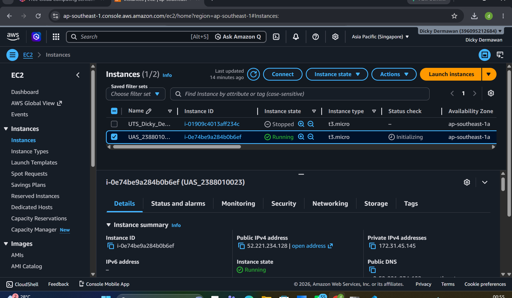

2. Koneksi SSH Server
Melakukan koneksi remote ke server AWS EC2 menggunakan protokol SSH melalui terminal lokal untuk mempersiapkan lingkungan Docker dan Git.
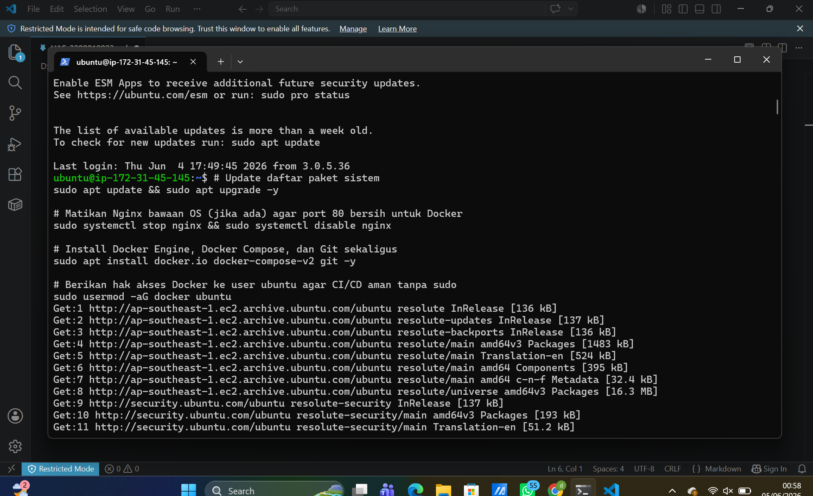

3. Membuat Dockerlife di web-dinamis
Membuat berkas konfigurasi Dockerfile di dalam direktori web-dinamis menggunakan base image PHP Apache untuk mengotomatisasi penyalinan kode sumber aplikasi web dinamis.
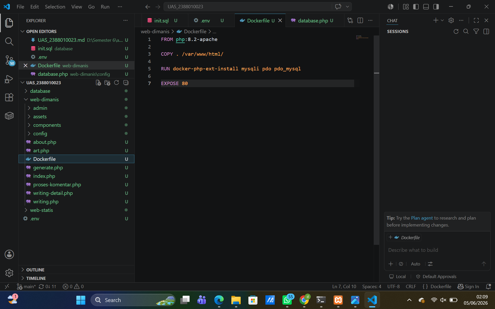

4. membuat Dockerlife di web-statis
Membuat berkas konfigurasi Dockerfile di dalam direktori web-statis menggunakan base image nginx:alpine yang ringan demi efisiensi performa web statis.
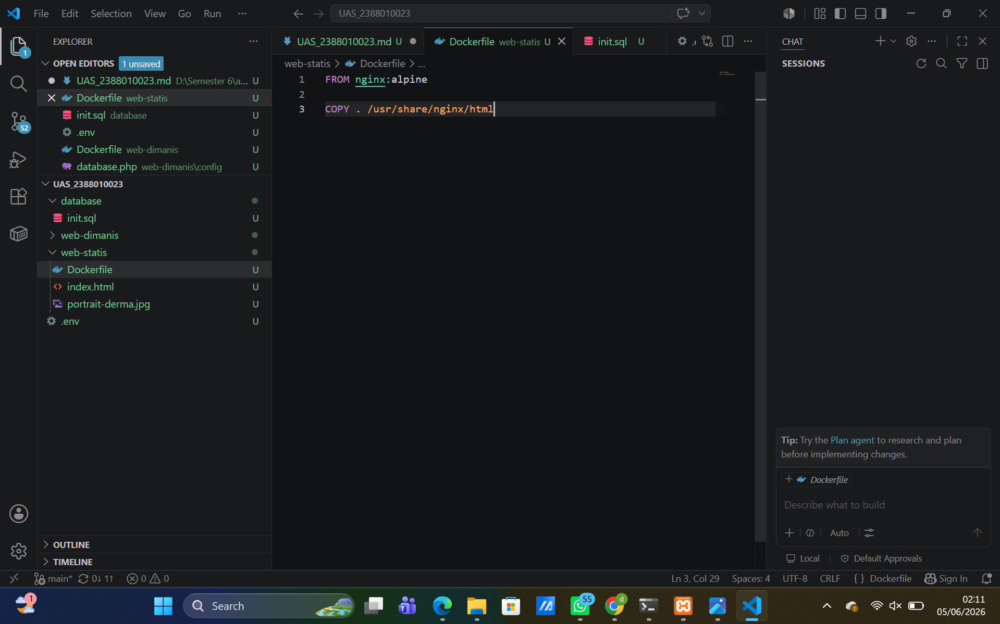

5. docker compose ps
Menjalankan perintah docker compose ps di terminal server untuk memverifikasi status kontainer. Seluruh layanan (mariadb, dynamic-web, dan static-web) dipastikan telah berstatus Up/Running.
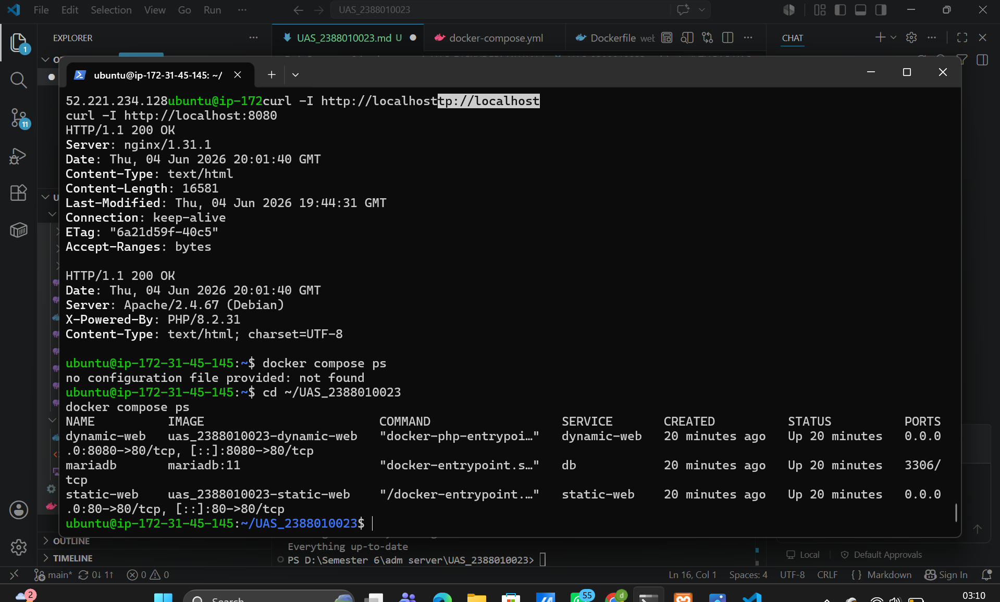

6. Pengujian Akses Website Publik dan Database Auto-Seed

(Web Statis): Buka http://52.221.234.128 pastikan berhasil di buka
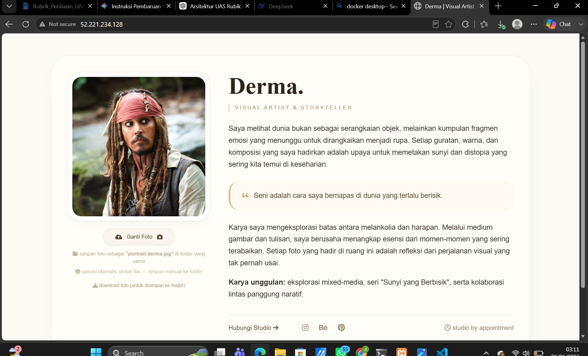

(Web Dinamis & Database): Buka http://52.221.234.128:8080 pastikan berhasil dibuka

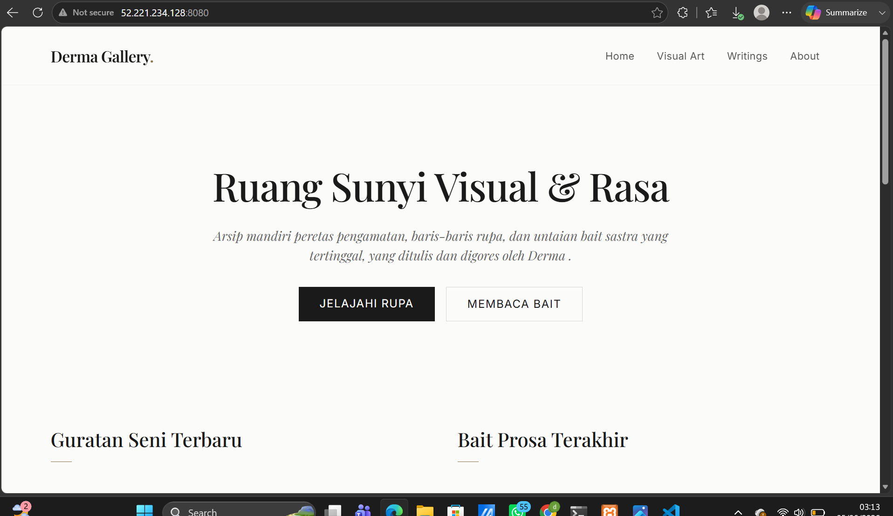

7. membuat repo docker baru
Membuat repositori publik baru di Docker Hub dengan akun dickydermawan12/uas_2388010023 sebagai tempat penyimpanan (registry) image hasil kompilasi pipeline.
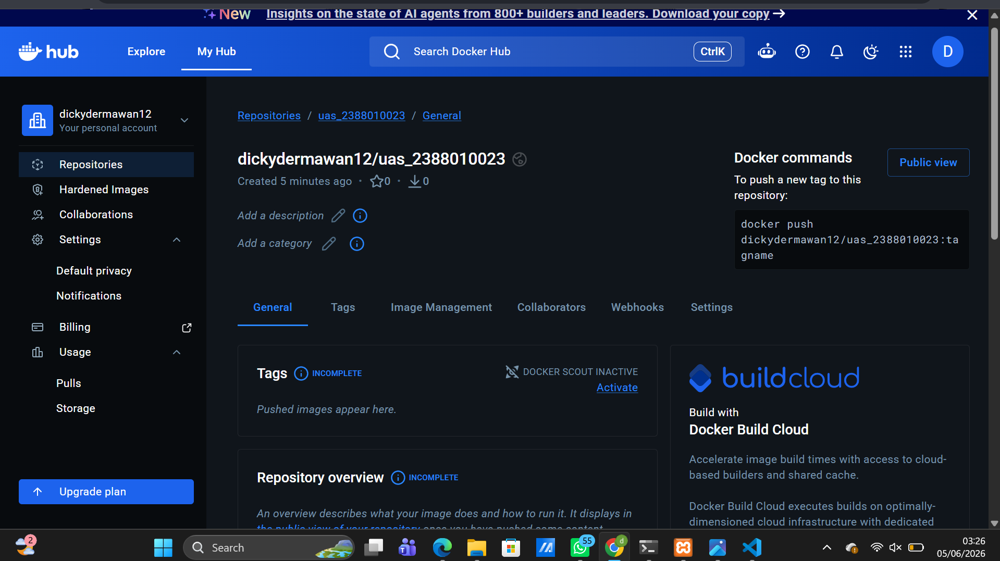

8. Pengisian GitHub Secrets
Mengonfigurasi variabel sensitif pada GitHub Secrets (seperti DOCKERHUB_USERNAME dan DOCKERHUB_TOKEN) agar GitHub Actions dapat melakukan otentikasi aman ke Docker Hub.
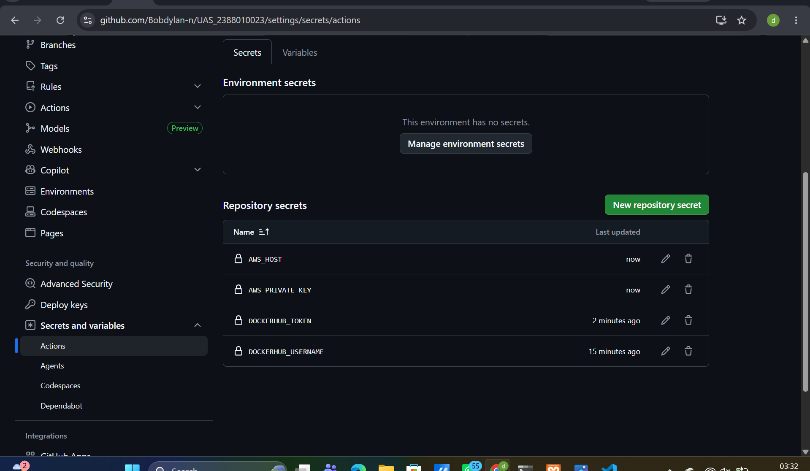

9. Membuat File Workflow CI/CD di VS Code

Buat folder baru bernama .github (ingat pakai tanda titik di depan).

Di dalam folder .github, buat folder baru lagi bernama workflows.

Di dalam folder workflows, buat dua file baru:

static.yml

dynamic.yml
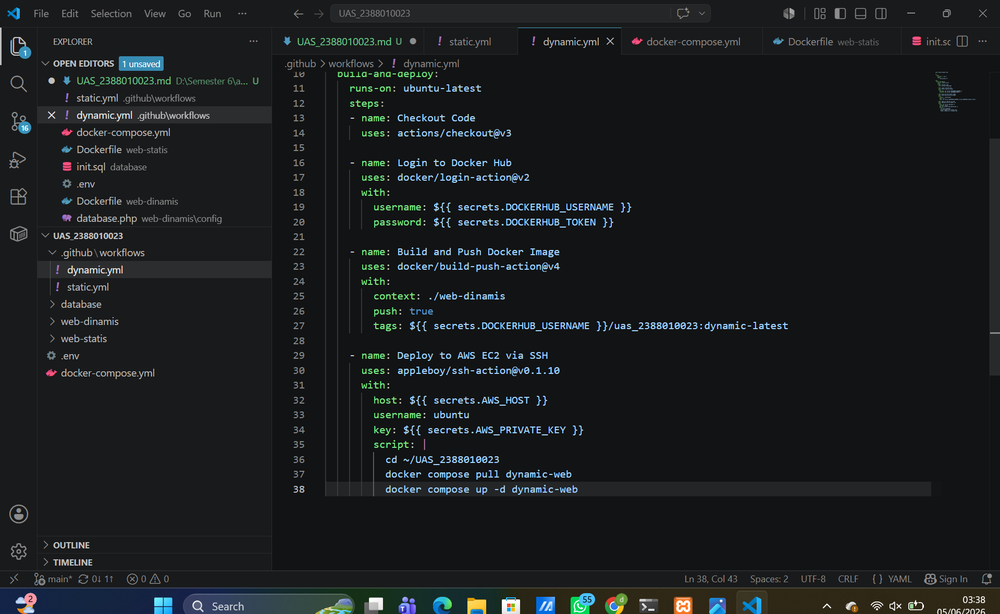

10. Memantau Pipeline GitHub Actions
Memantau jalannya integrasi pada tab GitHub Actions. Pipeline berhasil dieksekusi secara otomatis dan menunjukkan indikator centang hijau (sukses), menandakan image terbaru telah siap di server produksi.
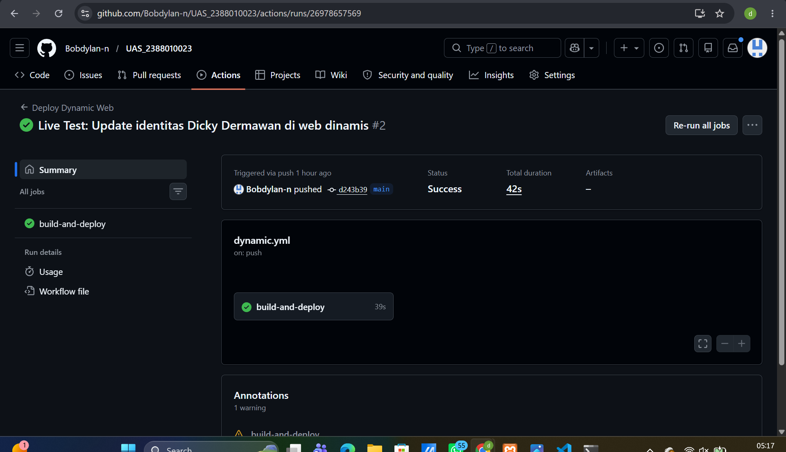

11. Verifikasi Status Akhir Kontainer di Server AWS
Menjalankan perintah docker compose ps kembali di terminal SSH AWS setelah alur CI/CD selesai untuk memastikan seluruh kontainer berjalan menggunakan image terbaru yang ditarik dari Docker Hub.

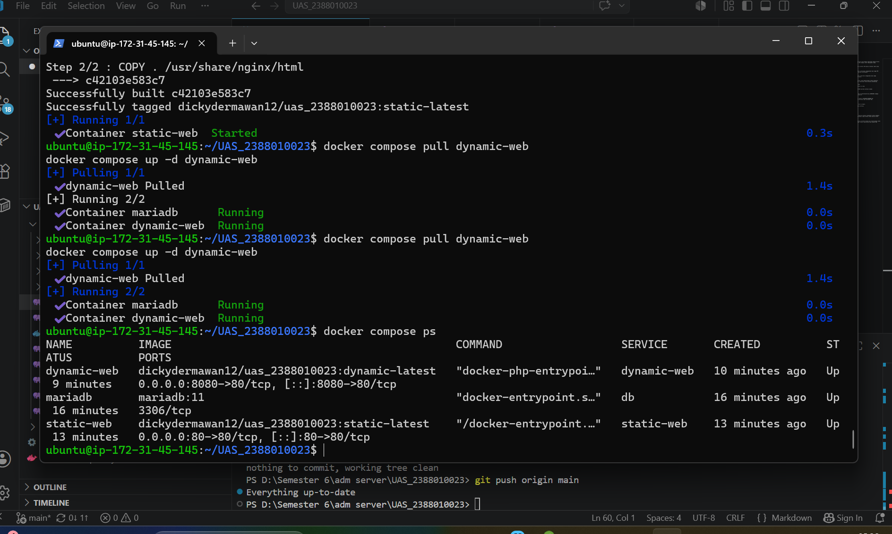

12. Pengujian Akses Website Publik Final (Hasil Update)

Web Statis (Port 80): [http://52.221.234.128]
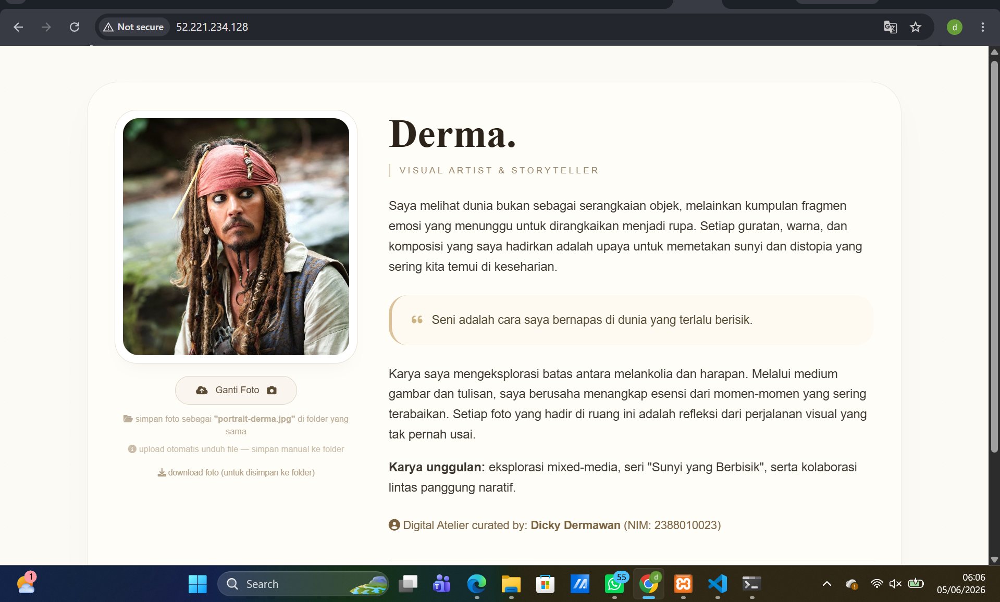

Web Dinamis & Database (Port 8080): [http://52.221.234.128:8080]
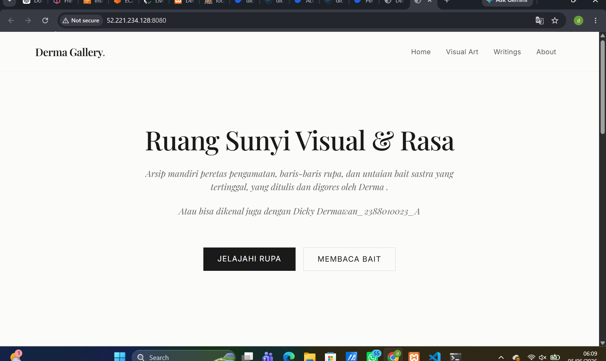

akses admin [http://52.221.234.128:8080/admin] 
menggunakan username = admin
            pass = admin123
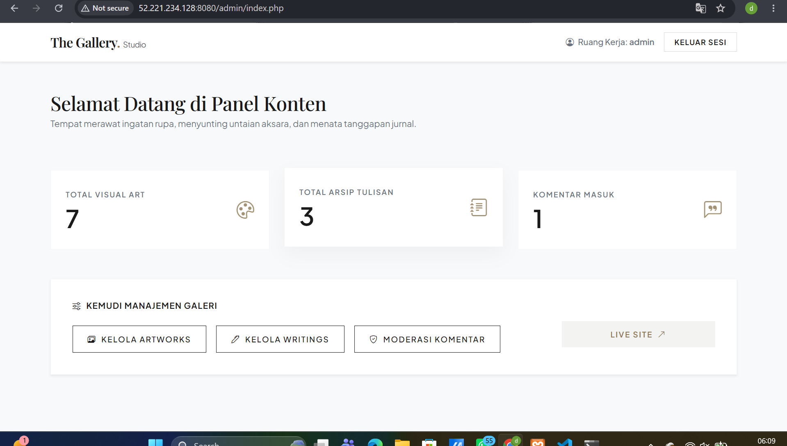

projek

https://github.com/Bobdylan-n/UAS_2388010023.git